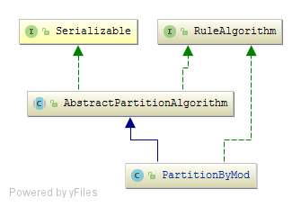

## MyCAT分片算法详解--概述

### 作者
陈刚

### 日期
2018-04-05

### 标签
MyCAT 分片

### 环境与版本说明
MySQL：5.6.22

MyCAT：1.6.5

### 概述

分片算法是分布式数据库的核心，算法种类的多少和性能直接影响应用的使用。

MyCAT 1.6.5版本，共有17中分片算法，包括：枚举、范围、哈希等等。

### 配置方法
在MyCAt中配置分片表，主要涉及以下步骤：

1、首先在schema.xml中定义一张分片表，例如：
~~~
<table name="t1" dataNode="dn0000,dn0001,dn0002,dn0003,dn0004,dn0005,dn0006,dn0007" rule="rule-t1" />
~~~
说明：

name：表名为t1；

dataNode：分片表分布在哪些分片上，该名称引用的是dataNode的标签；本例总共分布在8个分片中；

rule：分片规则名，该分片规则名引用的是rule.xml文件中相应的规则定义；

2、在rule.xml文件中定义分片规则
  
规则定义分两部分：
  
（1）tableRule部分

这部分定义的是按照哪个字段进行分片，分片的算法是哪个。

~~~
<tableRule name="rule-t1">
		<rule>
			<columns>c1</columns>
			<algorithm>t1-function</algorithm>
		</rule>
	</tableRule>
~~~
说明：

name:表规则名称，一般是每张表对应一个表规则；

columns：分片字段名；

algorithm：分片算法，引用的是如下的function定义；

（2）function部分

这部分定义的是具体分片算法的描述。
~~~
	<function name="t1-function" class="io.mycat.route.function.PartitionByMod">
		<property name="count">8</property>
	</function>
~~~
说明：

function name：算法名称；

class：实现算法的java类；

property name：是该算法需要的一些辅助属性和属性值，不同分片算法所用到的属性个数不同。

本例中是取模算法，只需要一个属性，该属性定义了取模的除数为8，表示共分布在8个分片中。

3、创建表

前两步只是在MyCAT的配置文件中只是定义了一张分片表，但是该表还没有真实创建。需要使用mysql客户端或命令行连接到MyCAT实例，然后执行表的创建SQL才能实际的创建该分片表。

连接MyCAT实例，执行建表语句，并插入数据：
~~~
mysql -h127.0.0.1 -P8066 -uroot -p123456
......
mysql> 
mysql> show databases;
+----------+
| DATABASE |
+----------+
| demo     |
+----------+

mysql> use demo
Database changed

mysql> create table t1(id int,c1 int,c2 varchar(100));
Query OK, 0 rows affected (1.14 sec)

mysql> insert into t1(id,c1,c2)
       values
       (0,0,database()),
       (1,1,database()),
       (2,2,database()),
       (3,3,database()),
       (4,4,database()),
       (5,5,database()),
       (6,6,database()),
       (7,7,database());
Query OK, 8 rows affected (0.05 sec)
~~~

4、查询数据。
~~~
mysql> select * from t1 order by c1;
+------+------+-----------+
| id   | c1   | c2        |
+------+------+-----------+
|    0 |    0 | demo_0000 |
|    1 |    1 | demo_0001 |
|    2 |    2 | demo_0002 |
|    3 |    3 | demo_0003 |
|    4 |    4 | demo_0004 |
|    5 |    5 | demo_0005 |
|    6 |    6 | demo_0006 |
|    7 |    7 | demo_0007 |
+------+------+-----------+
8 rows in set (0.02 sec)
~~~

### 源码分析
在源码层面上来看，不同分片算法的Java实现方式类似。

以“取模”分片算法为例，该算法对应的类为：io.mycat.route.function.PartitionByMod

该类继承了一个抽象类和一个接口，继承关系如下图所示：

1、接口RuleAlgorithm

接口io.mycat.config.model.rule.RuleAlgorithm是所有分片算法的公共接口，该接口共定义三个方法，分别是：

（1）、init
~~~ java
void init();
~~~
该方法主要是在MyCAT实例启动时，根据具体分片算法的需求对该算法做一些初始化的操作。当然，某些算法可能不需要做初始化。

（2）、calculate
~~~
Integer calculate(String columnValue) ;
~~~
该方法是根据字段值，计算某行数据位于的分片数据库的序号。分片编号从0开始。

（3）、calculateRange
~~~
Integer[] calculateRange(String beginValue,String endValue) ;
~~~
根据字段值的范围计算这些行所在分片编号数组。

2、抽象类AbstractPartitionAlgorithm

该抽象类共5个方法，分别为：

（1）init
~~~
	@Override
	public void init() {
	}
~~~
该方法在这个抽象类中仍然没有任何逻辑，因为具体的算法做什么样的初始化，需要根据具体的算法而定，无法抽象出一个统一的逻辑。

（2）calculateRange
~~~
	@Override
	public Integer[] calculateRange(String beginValue, String endValue)  {
		return new Integer[0];
	}
~~~
该方法没有实质性的业务逻辑，只简单返回一个整形数值0。实际的分片算法类中会根据需求重写该方法。

（3）、calculateSequenceRange
~~~
	public static Integer[] calculateSequenceRange(AbstractPartitionAlgorithm algorithm, String beginValue, String endValue)  {
		Integer begin = 0, end = 0;
		begin = algorithm.calculate(beginValue);
		end = algorithm.calculate(endValue);

		if(begin == null || end == null){
			return new Integer[0];
		}
		
		if (end >= begin) {
			int len = end-begin+1;
			Integer [] re = new Integer[len];
			
			for(int i =0;i<len;i++){
				re[i]=begin+i;
			}
			
			return re;
		}else{
			return new Integer[0];
		}
	}
~~~
该方法是一个通用方法，适合于存储的数据是按照顺序存放的，那么可以通过该方法获得一个顺序的分片编号。

该通用方法适合于如下算法：
* 范围分片（io.mycat.route.function.AutoPartitionByLong）
* 单月按小时分片（io.mycat.route.function.LatestMonthPartion）
* 固定分片hash算法（io.mycat.route.function.PartitionByLong）
     
（4）、suitableFor
~~~
	public final int suitableFor(TableConfig tableConf) {
		int nPartition = getPartitionNum();
		if(nPartition > 0) { // 对于有限制分区数的规则,进行检查
			int dnSize = tableConf.getDataNodes().size();
			boolean  distTable = tableConf.isDistTable();
			List tables = tableConf.getDistTables();
			if(distTable){
				if(tables.size() < nPartition){
					return  -1;
				} else if(dnSize > nPartition) {
					return 1;
				}
			}else{
				if(dnSize < nPartition) {
					return  -1;
				} else if(dnSize > nPartition) {
					return 1;
				}
			}
		}
		return 0;
	}
~~~
该方法是用来校验分片算法的分片总数与在schema.xml中定义的表所分布的dataNode的总数量是否一致。
共返回三种值：
* -1：if table datanode size < rule rule function partition size
* 0：if table datanode size = rule function partition size
* 1：if table datanode size > rule function partition size

4、具体分片算法实现类（PartitionByMod）

该类就是每个分片算法实际的类。根据需要，一般会重写init()和calculate()两个方法。

### 延伸阅读
[MyCAT分片算法详解--取模算法](20180407.md)
[MyCAT分片算法详解--枚举算法](20180409.md)

---
更多分布式数据库技术，请关注“分布式数据库技术”公众号.

